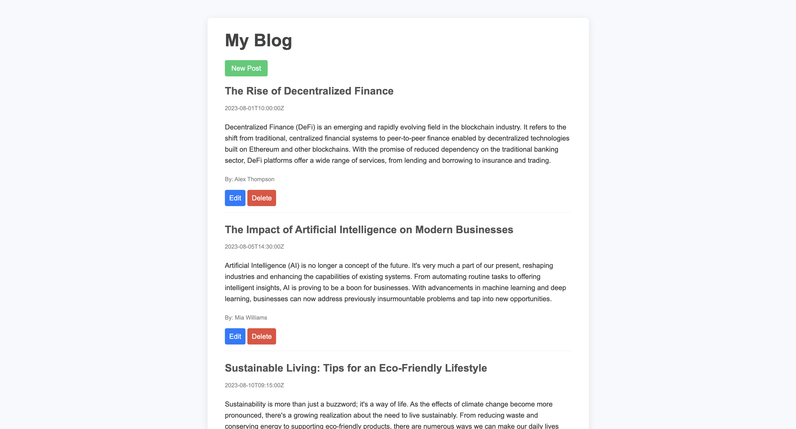

# Blog API


Developed a REST API that supports the four CRUD operations. Created using EJS, Node.js, Express.js, and Axios.

First, install dependencies:
```
npm i
```

Then, run the API:
``` 
node index.js
```

See website:
```
node server.js
```